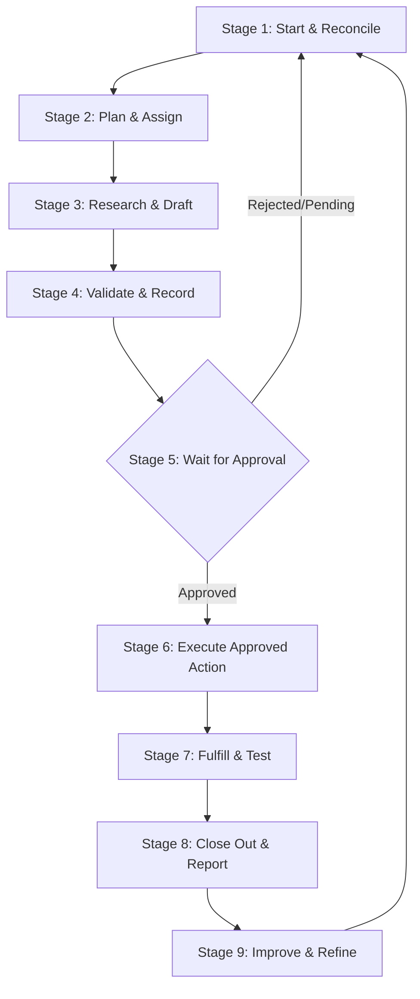

# 9-Stage Repeatable Operating Loop

The business operates autonomously through a structured 9-stage execution cycle managed by `Atlas-Orchestrator`.

## Stage 1: Start
1. Generate a unique Run ID (`RUN-YYYYMMDD-HHMM-XX`).
2. Read command-center control cells in `Start Here`, `Agent Guide`, and `System Setup`.
3. Confirm that **EXACTLY ONE** offer is active. (If 0 or >1, STOP and request direction).
4. Check setup readiness and credential locations.
5. Check pending items in `Approval Queue`.
6. Check follow-ups due, paid jobs, balances, and active blockers.
7. Present current state summary and next 3 recommended actions to Tom Gronek.

## Stage 2: Plan
1. Convert the active business goal into dependency-ordered tasks.
2. Assign owners from the specialist agent roster.
3. Define factual evidence requirements and stopping rules for each task.
4. Mark blocked tasks clearly.
5. Avoid creating unnecessary agents, tasks, or speculative code.

## Stage 3: Research & Draft
1. Specialist agents (`Scout-Research`, `Offer-Strategist`, `Proof-Builder`, `Outreach-Drafter`) perform safe internal work.
2. Research local business information using truthful public sources.
3. Qualify prospects and check duplicate / do-not-contact lists.
4. Create labeled proof assets, mock-ups, or audit previews.
5. Draft personalized outreach referencing factual observations.
6. Prepare structured Change Packets matching `.agents/rules/01-single-writer-contract.md`.

## Stage 4: Validate & Record
1. `Atlas-Orchestrator` validates specialist Change Packets.
2. Update authorized fields in the live Google Sheet.
3. Read changed cells back to verify write success.
4. Append an entry to `Activity Log`.
5. Create approval requests in `Approval Queue` for any gated external actions.

## Stage 5: Wait for Approval
1. Stop affected external action immediately.
2. Continue only safe, independent internal work.
3. **DO NOT** reinterpret silence as approval.
4. Present approval requests clearly to Tom Gronek.

## Stage 6: Execute Approved Action
1. Reconfirm that approval is valid, unexpired, and unchanged.
2. Perform ONLY the approved action.
3. Capture execution evidence (timestamp, response ID, log).
4. Detect partial failure or timeouts.
5. Update affected records and append to `Activity Log`.

## Stage 7: Fulfill & Test
1. Confirm written scope and verified payment status (G3).
2. Complete customer deliverable safely within isolated workspace.
3. Perform QA testing (`QA-Risk`) for links, forms, claims, mobile behavior, backups, and rollback procedures.
4. Request G4 approval before client system access, deployment, publication, or asset transfer.

## Stage 8: Close Out & Report
Generate and report complete metrics:
- Qualified prospects
- Contacts attempted & replies received (positive / negative / opt-outs)
- Discovery calls scheduled
- Proposals sent & jobs won
- Deposits verified & balances collected
- Work delivered & QA status
- Pending approvals & active blockers
- Single most valuable next action

## Stage 9: Improve
1. Identify **ONE** controlled test variable at a time (e.g. outreach angle, headline, target niche).
2. Preserve existing baseline data.
3. Request G5 approval before material changes.
4. Compare automated results against verified manual baselines.
